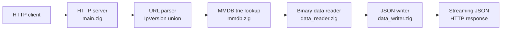

# GeoIP2-zig

[](https://ziglang.org/)
[](LICENSE)

A hand-rolled implementation of the MaxMind GeoIP2 binary format in Zig. No external dependencies for the core logic — just Zig's standard library and a 40MB embedded database. The project explores low-level systems programming: binary protocol parsing, Patricia trie traversal, and Zig's async I/O model.

**Performance: ~5K requests/second.** Load test results are published in every CI run's job summary.

## Quick Start

```shell
zig build
./zig-out/bin/geoip-zig
curl http://127.0.0.1:8080/ipv4/8.8.8.8
```

## What It Demonstrates

| Skill | Where it shows up |
|-------|-----------------|
| Binary protocol parsing | `mmdb/data_reader.zig` — bit-level decoding of MaxMind's custom binary format |
| Patricia trie traversal | `mmdb/mmdb.zig` — zero-allocation trie walk for IP lookup |
| Streaming JSON serialization | `mmdb/data_writer.zig` — direct binary-to-JSON without intermediate representation |
| Manual async event loop | `src/main.zig` — Zig's `Io.Threaded` with per-connection async handlers |
| Explicit memory management | Fixed-buffer allocator for parsing; embedded database avoids runtime file I/O |
| POSIX signal handling | `src/signals.zig` — graceful shutdown on SIGTERM/SIGINT |

## Architecture



## Building

```shell
zig build
```

> **Note:** If you create a `GeoIP.conf` file for the `download-mmdb` tool, never commit it. Prefer setting `MAXMIND_LICENSE_KEY` as an environment variable instead.

Run with defaults (`127.0.0.1:8080`) or override:

```shell
./zig-out/bin/geoip-zig --port 9000
```

## Testing

```shell
./run_tests.sh
```

Unit tests only:

```shell
zig build test
```

## API

```
GET /ipv4/8.8.8.8
GET /ipv6/2001:4860:4860::8888
```

Response:

```json
{
  "country": { "iso_code": "US", "names": { "en": "United States" } },
  "city": { "names": { "en": "Mountain View" } },
  "location": { "latitude": 37.4223, "longitude": -122.0848, "time_zone": "America/Los_Angeles" }
}
```

## Project Structure

```
src/
├── main.zig              # entry point, http server, async connection handling
├── signals.zig           # POSIX signal handlers for graceful shutdown
├── mmdb/
│   ├── mmdb.zig         # MMDB file loader, trie traversal, lookup API
│   ├── data_reader.zig  # binary format parser (pointers, maps, strings, integers)
│   ├── data_writer.zig  # binary-to-JSON serialization
│   └── metadata.zig     # database metadata parser
```

## The Code

The interesting files to read:

- **`data_reader.zig`** — Shows how to decode a real binary format byte-by-byte: variable-length encoding, pointer resolution, bit-level operations.
- **`mmdb.zig`** — The Patricia trie search. Walks 128 bits of an IP address through a precomputed binary trie. No heap allocations after startup.
- **`main.zig`** — Zig async I/O in action. Each connection gets its own async task via `Io.Group`. Streaming JSON response written directly to the socket buffer.

## License

GPLv3 License. See the [LICENSE](LICENSE) file and the [NOTICE](NOTICE) file for MaxMind database attribution requirements.
